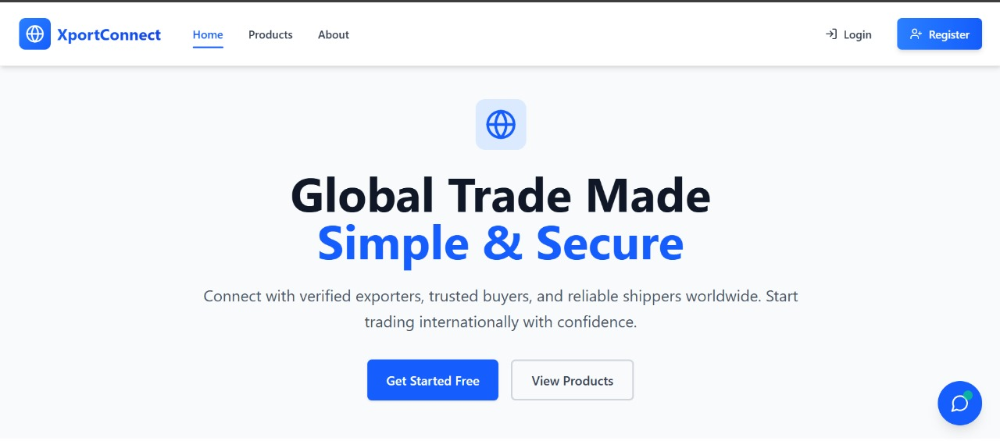

# XportConnect

XportConnect is a modern B2B export management platform designed to streamline global trade operations for exporters, buyers, and shipping partners. It offers a centralized solution to manage products, handle orders, assign shipping, and track deliveries.
The goal is to empower Indian SMBs and global exporters with a digital-first platform that simplifies international trade logistics, enhances buyer-exporter communication, and ensures transparency throughout the supply chain.
Built using the MERN stack (MongoDB, Express, React, Node.js), the platform ensures scalability, responsiveness, and a smooth user experience across all devices.

## 📽 Demo Video

[](https://www.youtube.com/watch?v=crqWGGTHnxA)

## FEATURES

### For Exporters
- **Authentication & Authorization**
  - Secure JWT-based login and registration system
  - Role-based access control for **Exporters, Buyers and Shippers**

- **Product Management (Exporters)**
  - Create, update, and delete product listings
  - Upload product images via Cloudinary integration
  - Categorized listings for better discoverability
  - Add specifications, pricing, and quantity details

- **Inquiry & Order Handling**
  - Buyers can place inquiries or create orders for listed products
  - Exporters can manage incoming orders and view order details

- **Shipping Management**
  - Exporters can assign shippers to orders
  - Shippers can update tracking status
  - Automated tracking number
  - Real-time shipping status updates

- **Order Tracking & Delivery**
  - Track orders with unique tracking numbers
  - View estimated delivery date and current shipping status

- **Address & Query Resolution System**
  - Users can save and manage shipping addresses
  - ChatBot for Queries of Users

- **Ratings & Reviews System (planned)**
  - Exporters and shippers can be rated and reviewed to improve trust and reliability.

## TECH STACK

### Frontend
- React.js
- Tailwind CSS
- Shadcn UI Components
- React Router
- Axios for API calls

### Backend
- Node.js
- Express.js
- MongoDB
- JWT Authentication
- Socket.io for real-time features

### Cloud
- Cloudinary

## INSTALLATION

1. Clone the repository:
   ```bash
   git clone 
   cd XportConnect-ExportManagement
   ```

2. Install frontend dependencies:
   ```bash
   cd frontend
   npm install
   ```

3. Install backend dependencies:
   ```bash
   cd  backend
   npm install
   ```

4. Set up environment variables:
   - Create a `.env` file in the backend directory with the following variables:
   ```env
   PORT=3000
   MONGODB_URI=your_mongodb_uri
   JWT_SECRET=your_jwt_secret
   CLOUDINARY_CLOUD_NAME=your_cloudinary_cloud_name
   CLOUDINARY_API_KEY=your_cloudinary_api_key
   CLOUDINARY_API_SECRET=your_cloudinary_api_secret
   FRONTEND_URI=your_frontend_uri
   VITE_GROQ_API_KEY=your_groq_api_key
   ```

   - Create a `.env` file in the frontend directory with the following variables:
   ```env
   VITE_API_URL=api_url
   ```

5. Start the development servers:

   Frontend:
   ```bash
   cd frontend
   npm run dev
   ```

   Backend:
   ```bash
   cd backend
   npm run dev
   ```

## PROJECT STRUCTURE

```
XportConnect-ExportManagement/
├── frontend/
│   ├── src/
│   │   ├── components/
│   │   ├── contexts/
│   │   ├── layouts/
│   │   ├── lib/
│   │   ├── pages/
│   │   └── services/
│   └── public/
└── backend/
    |── config/
    │── controllers/
    │── middlewares/
    │── models/
    │── routes/
    │── utils/
    └── server.js
```
<!-- ## 📝 API Documentation

API documentation is available at `/api-docs` when running the backend server. -->

## 🤝 CONTRIBUTING

1. Fork the repository
2. Create your feature branch (`git checkout -b feature/AmazingFeature`)
3. Commit your changes (`git commit -m 'Add some AmazingFeature'`)
4. Push to the branch (`git push origin feature/AmazingFeature`)
5. Open a Pull Request

## 📄 LICENSE

This project is licensed under the MIT License - see the [LICENSE](./LICENSE) file for details.

